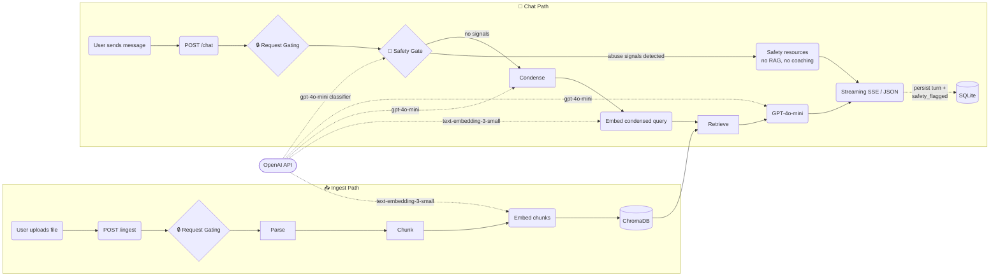
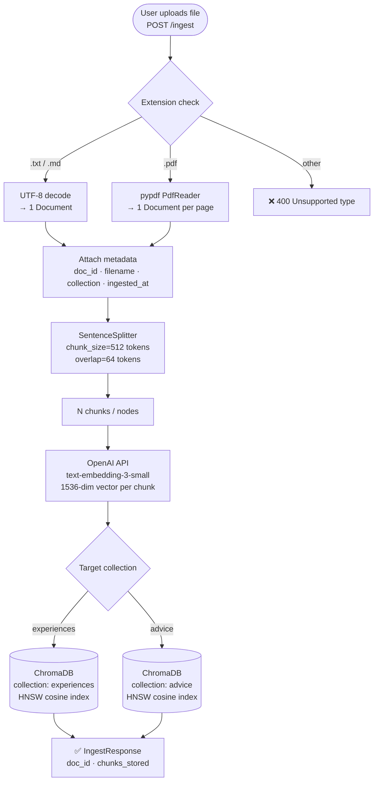
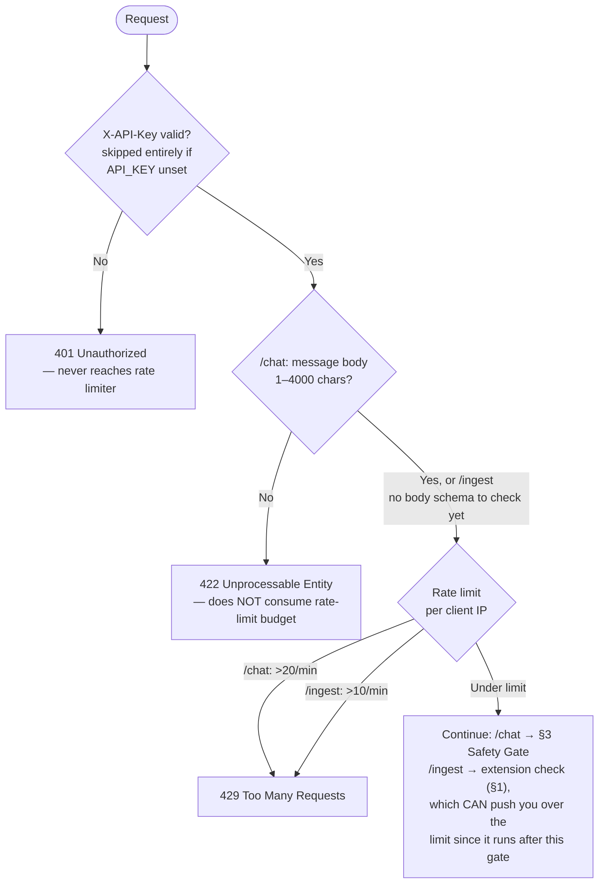
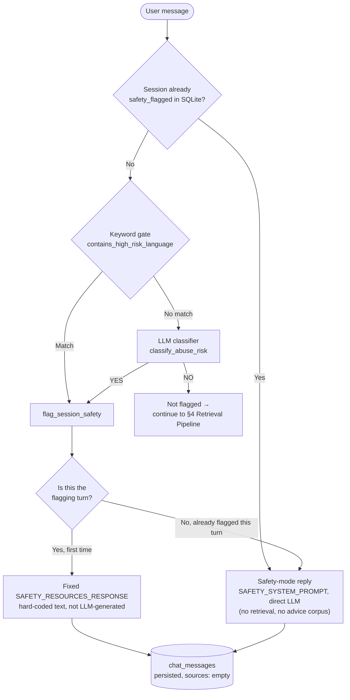
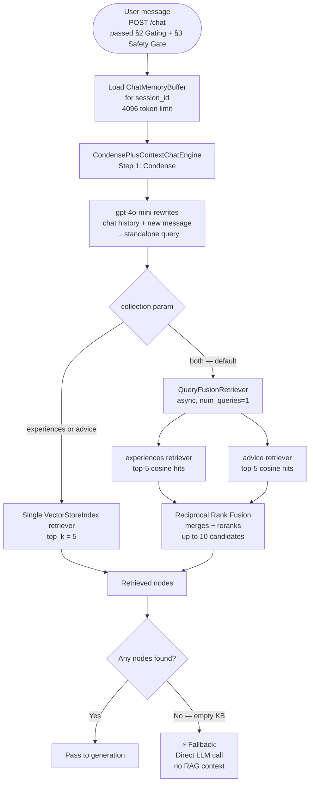
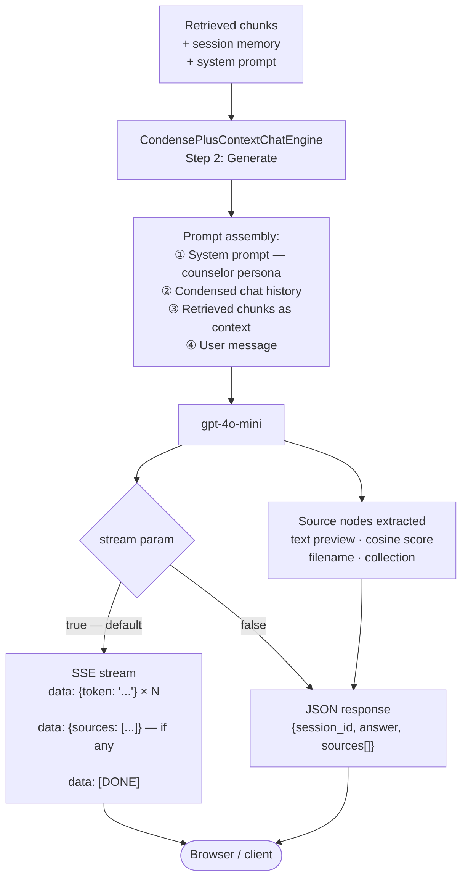
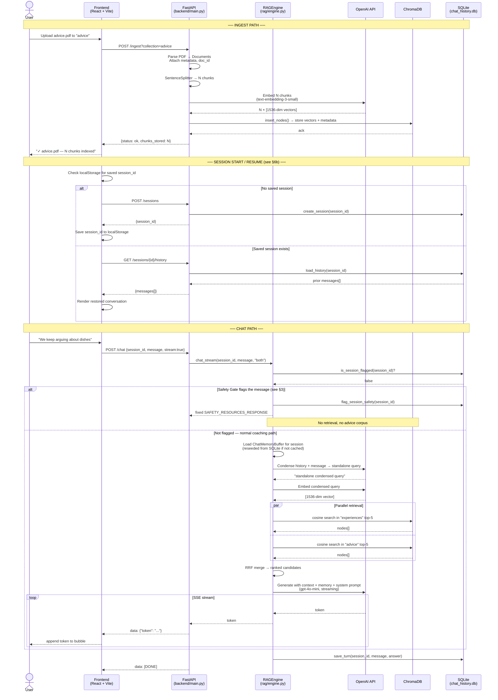
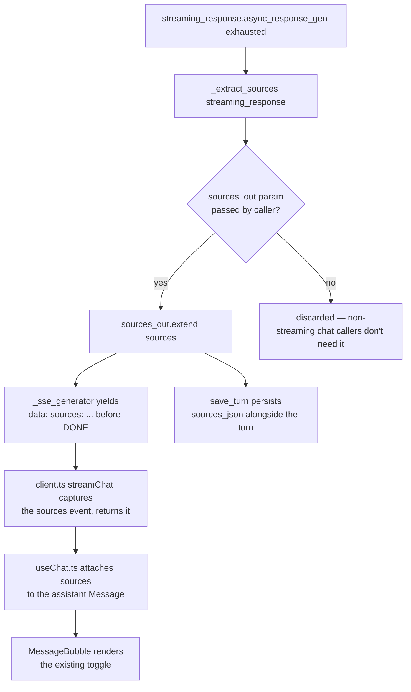

# happy-wife-gpt — RAG System Architecture

> A breakdown of the full pipeline: how requests are authenticated and rate-limited, how documents are ingested, embedded, stored, retrieved, fused, and used to generate grounded responses — and how a safety gate routes signs of abuse away from ordinary conflict coaching before any of that runs.

---

## System Overview



> 🔒 Request Gating (auth, body validation, rate limiting) — see §2 — happens on **every**
> request, before either path's real work begins.

---

## 1. Ingestion Pipeline

How a document goes from an uploaded file to searchable vectors in ChromaDB.



### Step-by-step

| Step | Code | Detail |
|---|---|---|
| **Upload** | `POST /ingest` | `multipart/form-data`; `collection` is a query param (`advice` default) |
| **Extension gate** | `routers/ingest.py` | Only `.txt`, `.md`, `.pdf` accepted; 400 otherwise |
| **Parse PDF** | `rag/ingestion.py → _parse_pdf_bytes` | `pypdf.PdfReader`; one `Document` per page; empty pages skipped |
| **Parse text** | `rag/ingestion.py → _parse_text_bytes` | UTF-8 decode with error replacement; single `Document` |
| **doc_id** | `_generate_doc_id()` | `{filename_stem[:32]}_{sha256(content)[:12]}` — deterministic, deduplication-safe |
| **Chunking** | `SentenceSplitter` | Sentence-aware splitting at 512-token boundaries; 64-token overlap preserves context across chunk edges |
| **Embedding** | `OpenAIEmbedding(text-embedding-3-small)` | 1536-dimensional dense vectors; called by LlamaIndex internally on `insert_nodes()` |
| **Storage** | `ChromaBackend.get_store(collection)` | Each chunk stored as: `{id, embedding, text, metadata}`; cosine HNSW index |

---

## 2. Request Gating

Runs on every `POST /chat` and `POST /ingest` request, before either endpoint's real work
begins (including before the Safety Gate in §3). Three independent checks, and — this matters
for interpreting logs — **they run in different relative order on the two endpoints**, verified
empirically against the running server rather than assumed from the code:



### Step-by-step

| Step | Code | Detail |
|---|---|---|
| **Auth** | `auth.py → require_api_key`, router-level `Depends` | Checked first, before anything else. No-op (always passes) when `API_KEY` is unset in `.env` — local-dev convenience. As of this pass, a real key is generated and set by default, so auth is enforced unless you deliberately clear it |
| **Body validation (`/chat` only)** | `models/schemas.py → ChatRequest.message` | Pydantic `min_length=1, max_length=4000`, resolved as part of FastAPI's parameter binding — happens *before* the rate-limit decorator runs, so oversized/empty messages don't cost you rate-limit budget. Verified: 25 consecutive oversized requests all returned 422, never 429 |
| **Rate limiting** | `rate_limit.py` shared `Limiter` (slowapi), `@limiter.limit(...)` on each route | Per-client-IP, in-memory (`get_remote_address` key func), fixed/moving window. `/chat`: 20/min. `/ingest`: 10/min |
| **`/ingest` extension check runs *after* rate limiting** | `routers/ingest.py → ingest_document()` | Unlike `/chat`'s message length, the `.txt`/`.md`/`.pdf` extension check is plain code inside the endpoint body, which only executes *after* the rate-limit decorator has already counted the request. Verified: sending 15 bad-extension uploads returned `400` for the first 10, then `429` for the rest — bad uploads do burn your `/ingest` rate-limit budget |

> **Why this asymmetry exists, not just what it is:** `/chat`'s validation is a Pydantic field on
> the request body, which FastAPI resolves *before* calling the (decorated) endpoint function —
> so it runs ahead of the `@limiter.limit()` decorator, which only executes once the function body
> starts. `/ingest` has no such body schema (it's `File(...)` + `Query(...)`), so its equivalent
> check is hand-written code *inside* the function — by the time it runs, the rate limiter has
> already counted the request.

---

## 3. Safety Gate

Runs first, before any retrieval or the marriage-counselor persona. Distinguishes ordinary
relationship conflict (safe to coach) from signs of intimate partner violence or coercive control
(unsafe to coach — routed to hotline resources instead). Sticky per session: once a session is
flagged, it stays flagged for every subsequent turn, even if later messages don't repeat risk
language.



### Step-by-step

| Step | Code | Detail |
|---|---|---|
| **Sticky check** | `ChatHistoryStore.is_session_flagged()` | If the session was already flagged on a prior turn, skip straight to safety-mode reply — no keyword/LLM check needed |
| **Keyword gate** | `rag/safety.py → contains_high_risk_language()` | Deterministic regex match for explicit red flags: physical violence, weapons, threats to kill/hurt, fear of partner, sexual coercion, stalking, surveillance, isolation, financial control. Zero LLM involvement — the clearest, highest-danger disclosures never depend on model judgment |
| **LLM classifier fallback** | `rag/safety.py → classify_abuse_risk()` | Only runs if the keyword gate found nothing. One extra `gpt-4o-mini` call, given the message + last 6 turns of memory, forced to answer `YES`/`NO` against a CDC/Hotline-derived rubric — catches indirect disclosures ("he doesn't let me see my friends anymore") that keywords miss |
| **Flag + persist** | `ChatHistoryStore.flag_session_safety()` | Sets `chat_sessions.safety_flagged = 1`; sticky for the rest of the session |
| **First flagged turn** | `rag/safety.py → SAFETY_RESOURCES_RESPONSE` | A fixed, hand-written string (National DV Hotline, text line, thehotline.org, 911) — deterministic on purpose, since this is the highest-stakes single message |
| **Later flagged turns** | `rag/prompts.py → SAFETY_SYSTEM_PROMPT` | Direct LLM call (no `CondensePlusContextChatEngine`, no retrieval) with a system prompt that forbids "both sides"/de-escalation framing and forbids suggesting couples counseling — advocates specifically advise against joint counseling when abuse is present |
| **Not flagged** | — | Falls through unchanged to the normal Retrieval → Generation pipeline (§4–5) with `MARRIAGE_COUNSELOR_SYSTEM_PROMPT` |

> **Known limitation.** The keyword list is a starting point covering the CDC/Hotline categories (fear, threats, violence, coercive control, isolation, stalking, forced sex, financial control, retaliation), not an exhaustive detector — real disclosures vary widely in phrasing. The LLM classifier is the safety net for phrasing the keyword list misses, but is still probabilistic.

---

## 4. Retrieval Pipeline

Only reached when the Safety Gate (§3) does **not** flag the message. How a user's message is
turned into a vector query and matched against stored chunks.



### Step-by-step

| Step | Code | Detail |
|---|---|---|
| **Session memory** | `RAGEngine._get_memory()` | `ChatMemoryBuffer` keyed by `session_id`, cached in-process; holds turn history up to 4096 tokens, evicts oldest turns when full. On cache miss (e.g. after a server restart), reseeded from `ChatHistoryStore.load_history()` — see §6b |
| **Condense** | `CondensePlusContextChatEngine` Step 1 | GPT-4o-mini rewrites `[history + message]` into a self-contained query — removes pronouns, resolves references |
| **Embed query** | `text-embedding-3-small` | Condensed query → 1536-dim vector; same model used at ingest time |
| **Single retrieval** | `VectorStoreIndex.as_retriever(similarity_top_k=5)` | Cosine similarity search in HNSW index; returns top-5 nodes with scores |
| **Fusion retrieval** | `QueryFusionRetriever(num_queries=1, use_async=True)` | Queries both collections in parallel; `num_queries=1` means no query expansion — just parallel retrieval |
| **RRF ranking** | Built into `QueryFusionRetriever` | Reciprocal Rank Fusion: score = Σ 1/(k + rank_i); merges up to 10 candidates ranked by combined score |
| **Empty fallback** | `engine.py → chat_stream / chat` | If retriever returns 0 nodes, skips `CondensePlusContextChatEngine` and calls GPT-4o-mini directly with memory + system prompt |

> **No dedicated reranker model.** RRF is the only cross-collection ranking step. A cross-encoder reranker (e.g. Cohere Rerank, `llama-index-postprocessor-cohere-rerank`) could be added as a post-retrieval step.

---

## 5. Generation Pipeline

How retrieved context is assembled into a prompt and streamed back. This is the path for
messages that pass the Safety Gate (§3) unflagged — flagged sessions skip straight to a direct
LLM call with `SAFETY_SYSTEM_PROMPT` and no retrieved chunks at all (see §3).



### Prompt assembly (what GPT-4o-mini actually receives)

```
[SYSTEM]
You are a calm, empathetic, and neutral marriage counselor...
(full persona from rag/prompts.py)

[ASSISTANT] (prior turns from ChatMemoryBuffer)
...

[USER] (prior turns from ChatMemoryBuffer)
...

[CONTEXT] (injected by CondensePlusContextChatEngine)
--- chunk 1 (from advice, score 0.87) ---
<text of chunk>
--- chunk 2 (from experiences, score 0.81) ---
<text of chunk>
...

[USER]
<condensed standalone query>
```

### Streaming format (SSE)

```
data: {"token": "It"}

data: {"token": " sounds"}

data: {"token": " like"}
...
data: {"sources": [{"text": "...", "score": 0.87, "source": "gottman-repair-attempts.md", "collection": "advice"}, ...]}

data: [DONE]
```

The `sources` event is only sent when the RAG path actually retrieved nodes — the safety-flagged
and empty-knowledge-base fallback paths (§3, §4) never emit one, since there's nothing to cite.
See §9 for how citations flow end-to-end.

The frontend reads this via `fetch` + `ReadableStream` (not `EventSource`, which only supports GET).

---

## 6. Full End-to-End Sequence

Request Gating (§2 — auth, body validation, rate limiting) applies to every `/chat` and
`/ingest` call below; omitted from the diagram itself to keep it readable.



### 6b. Session persistence notes

- **Reload survives.** `session_id` lives in `localStorage`, not just React state — refreshing the
  page re-fetches history from SQLite instead of starting a new conversation.
- **Restart survives.** `ChatMemoryBuffer` is an in-process cache keyed by `session_id`; on a cache
  miss (fresh process) it's reseeded from `ChatHistoryStore.load_history()`, so a backend restart
  doesn't lose conversational context either.
- **"New Conversation"** (frontend menu) calls `POST /sessions` again and overwrites the stored
  `session_id`, starting a genuinely fresh session — including a fresh (unflagged) safety state.

---

## 7. Component Reference

| Component | Implementation | Config key | Default |
|---|---|---|---|
| **LLM** | OpenAI `gpt-4o-mini` | `LLM_MODEL` | `gpt-4o-mini` |
| **Embedding model** | OpenAI `text-embedding-3-small` | `EMBEDDING_MODEL` | `text-embedding-3-small` |
| **Embedding dimensions** | 1536 | — | fixed by model |
| **Vector store (local)** | ChromaDB `PersistentClient` | `CHROMA_PERSIST_DIR` | `./chroma_db` |
| **Vector store (AWS)** | OpenSearch Serverless | `OPENSEARCH_ENDPOINT` | — |
| **Similarity metric** | Cosine (`hnsw:space=cosine`) | — | fixed |
| **Chunker** | `SentenceSplitter` | `CHUNK_SIZE` / `CHUNK_OVERLAP` | 512 / 64 |
| **Retrieval top-k** | per collection | `RETRIEVAL_TOP_K` | 5 |
| **Fusion** | `QueryFusionRetriever` + RRF | — | when collection=`both` |
| **Chat engine** | `CondensePlusContextChatEngine` | — | always (when not safety-flagged) |
| **Session memory** | `ChatMemoryBuffer`, in-process cache reseeded from SQLite | `MEMORY_TOKEN_LIMIT` | 4096 tokens |
| **Chat history store** | SQLite via stdlib `sqlite3` (`ChatHistoryStore`) | `CHAT_HISTORY_DB_PATH` | `./chat_history.db` |
| **Chat history store (AWS)** | RDS PostgreSQL (planned, not built) | — | see `docs/production-roadmap.md` Phase D |
| **Safety detection** | Regex keyword gate + `gpt-4o-mini` classifier fallback (`rag/safety.py`) | — | hybrid, sticky per session |
| **Safety response** | Fixed hotline referral text; no couples-counseling suggestion | — | hard-coded, not LLM-generated |
| **Collections** | `experiences`, `advice` | — | two separate HNSW indexes |
| **Doc ID scheme** | `{stem[:32]}_{sha256[:12]}` | — | deterministic |
| **Supported file types** | `.txt`, `.md`, `.pdf` | — | hardcoded |
| **Auth** | `X-API-Key` header, `auth.py → require_api_key` | `API_KEY` | enforced when set — a real key is now generated by default (see §2) |
| **Rate limiting** | `slowapi`, per-IP, in-memory (`rate_limit.py`) | — | `/chat` 20/min, `/ingest` 10/min (see §2 for precedence order) |
| **Chat message length** | Pydantic `Field(min_length=1, max_length=4000)` | — | on `ChatRequest.message` only — `/ingest` has no equivalent body-level check |

---

## 8. Two-Collection Design

```
ChromaDB
├── experiences    ← personal argument logs, emotional context, resolutions
│     hnsw:cosine
│     chunks: [text, embedding, doc_id, filename, collection, ingested_at, page?]
│
└── advice         ← marriage guidance articles, books, resources
      hnsw:cosine
      chunks: [text, embedding, doc_id, filename, collection, ingested_at, page?]
```

When `collection=both` (default in chat), both indexes are searched in parallel and results are merged via RRF. The source `collection` field is preserved in each returned chunk so the LLM (and UI) can distinguish where each piece of context came from.

---

## 9. Citations / Source Attribution

Each AI answer can show a collapsible "▸ N sources" toggle underneath it — filename, collection
badge, similarity score, and text snippet per retrieved chunk — so the user can verify what the
counselor actually drew from, without it cluttering the main reply.

**Why this only required backend plumbing, not new UI:** `MessageBubble.tsx` and the
`Message`/`SourceChunk` types already existed with this exact toggle built in. The non-streaming
`POST /chat` path (`stream:false`) already returned `sources` via `RAGEngine._extract_sources()`.
The gap was specifically the streaming path (the app's default and only path the frontend
actually calls): `chat_stream()` never captured `source_nodes` off the streaming response, and the
SSE parser only understood `{"token": ...}` events.



### Design notes

- **Output-parameter, not a new yield type.** `chat_stream()` gained an optional
  `sources_out: list[dict] | None` param instead of restructuring its
  `AsyncGenerator[str, None]` contract — there are 4 distinct yield sites (two safety-flagged
  paths, the empty-KB fallback, and the real RAG path), and only the RAG path ever has sources.
  The caller (`_sse_generator` in `routers/chat.py`) allocates a list, passes it in, and reads it
  back once the token loop finishes.
- **Same extraction logic as non-streaming.** Both paths call the existing
  `RAGEngine._extract_sources()` helper against their respective response objects
  (`achat()`'s return value vs. `astream_chat()`'s `streaming_response`), so citations look
  identical whether or not the request streamed.
- **Persisted, not just live state.** `chat_messages` gained a `sources_json TEXT` column
  (migrated in place via the same `PRAGMA table_info` + `ALTER TABLE` pattern already used for
  `safety_flagged`), populated by `save_turn(..., sources=...)` and returned by `load_history()`.
  Reloading the page or revisiting an old session restores citations, not just the message text.
- **No dedup, no ranking changes.** Citations are exactly the `source_nodes` the chat engine used
  to generate that specific answer — same chunks that could repeat the same source file multiple
  times if several of its chunks were retrieved. This matches the pre-existing non-streaming
  behavior; not a new design decision.

---

## 10. Honest Gaps (not yet implemented)

| Gap | Where it would go | Notes |
|---|---|---|
| **Cross-encoder reranker** | Post-retrieval step in `_build_retriever()` | e.g. Cohere Rerank or `llama-index-postprocessor-cohere-rerank`; would improve precision especially for `both` collection queries |
| **Score threshold filtering** | `_build_retriever()` or as a node postprocessor | `MIN_SCORE=0.3` exists in config but is not wired into the retriever |
| **Hybrid search** | Replace `VectorStoreIndex` retriever with a hybrid retriever | Combine keyword (BM25) + vector for better lexical recall |
| **Query expansion** | `QueryFusionRetriever(num_queries > 1)` | Set `num_queries=3` to generate multiple phrasings of the query; improves recall at cost of latency + API tokens |
| **Metadata filtering** | `retriever.retrieve(query, filters=...)` | e.g. filter by date range, collection, or doc_id |
| **Safety keyword coverage** | `rag/safety.py → _HIGH_RISK_PATTERNS` | Starting-point list, not exhaustive — see the limitation note in §3 |
| **Safety classifier cost/latency control** | `rag/engine.py → _check_safety()` | Every unflagged message pays one extra `gpt-4o-mini` call when the keyword gate finds nothing; no caching or batching yet |
| **Chat history on RDS Postgres** | `storage/chat_history_postgres.py` (not built) | Local SQLite only today; AWS path documented but unimplemented — see `docs/production-roadmap.md` Phase D |
| **Single shared API key** | `auth.py → require_api_key` | One static key for everyone, not per-user — fine for personal/local use, not a real multi-user auth model |
| **In-memory rate limiter** | `rate_limit.py` | Per-process, per-IP state — resets on restart and won't coordinate correctly across multiple backend instances (relevant once deployed behind ECS with >1 task) |
| **`/ingest` has no body-level length/size limit** | `routers/ingest.py` | Unlike `/chat`, there's no explicit file-size cap — relies on FastAPI/Starlette defaults |
