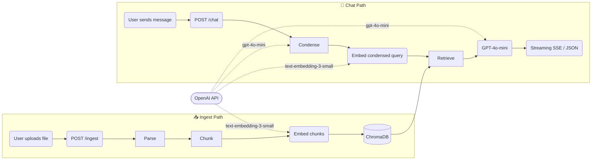
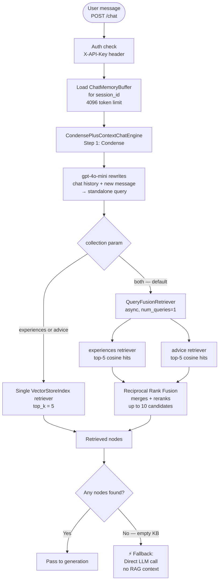
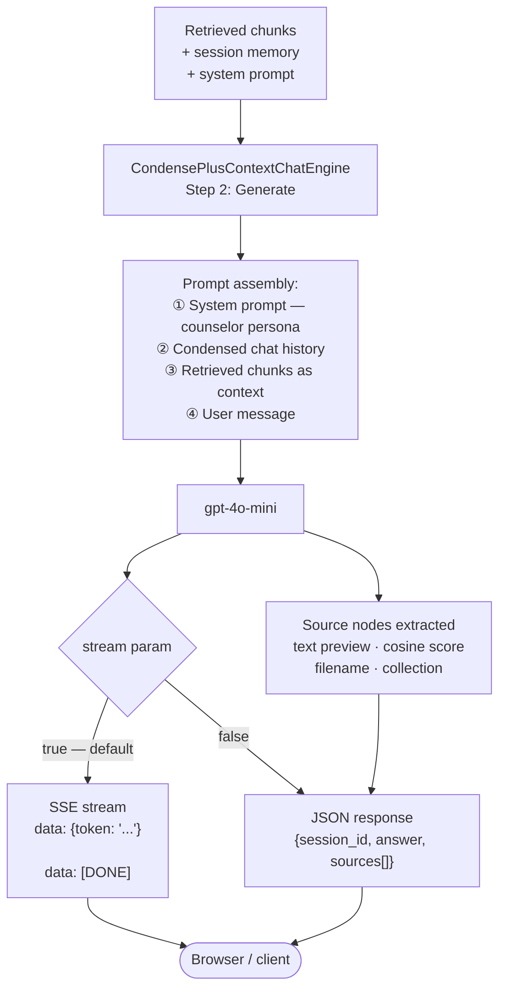
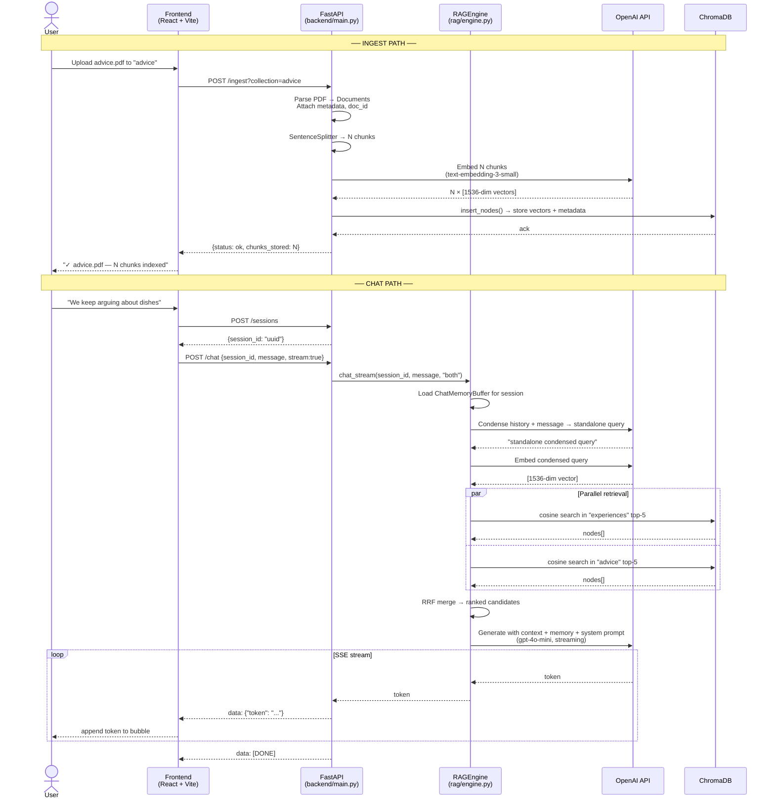

# happy-wife-gpt — RAG System Architecture

> A breakdown of the full pipeline: how documents are ingested, embedded, stored, retrieved, fused, and used to generate grounded responses.

---

## System Overview



---

## 1. Ingestion Pipeline

How a document goes from an uploaded file to searchable vectors in ChromaDB.


### Step-by-step

| Step | Code | Detail |
|---|---|---|
| **Upload** | `POST /ingest` | `multipart/form-data`; `collection` is a query param (`advice` default) |
| **Extension gate** | `routers/ingest.py` | Only `.txt`, `.md`, `.pdf` accepted; 400 otherwise |
| **Parse PDF** | `rag/ingestion.py → _parse_pdf_bytes` | `pypdf.PdfReader`; one `Document` per page; empty pages skipped |
| **Parse text** | `rag/ingestion.py → _parse_text_bytes` | UTF-8 decode with error replacement; single `Document` |
| **doc_id** | `_generate_doc_id()` | `{filename_stem[:32]}_{sha256(content)[:12]}` — deterministic, deduplication-safe |
| **Chunking** | `SentenceSplitter` | Sentence-aware splitting at 512-token boundaries; 64-token overlap preserves context across chunk edges |
| **Embedding** | `OpenAIEmbedding(text-embedding-3-small)` | 1536-dimensional dense vectors; called by LlamaIndex internally on `insert_nodes()` |
| **Storage** | `ChromaBackend.get_store(collection)` | Each chunk stored as: `{id, embedding, text, metadata}`; cosine HNSW index |

---

## 2. Retrieval Pipeline

How a user's message is turned into a vector query and matched against stored chunks.



### Step-by-step

| Step | Code | Detail |
|---|---|---|
| **Session memory** | `RAGEngine._get_memory()` | `ChatMemoryBuffer` keyed by `session_id`; holds full turn history up to 4096 tokens; evicts oldest turns when full |
| **Condense** | `CondensePlusContextChatEngine` Step 1 | GPT-4o-mini rewrites `[history + message]` into a self-contained query — removes pronouns, resolves references |
| **Embed query** | `text-embedding-3-small` | Condensed query → 1536-dim vector; same model used at ingest time |
| **Single retrieval** | `VectorStoreIndex.as_retriever(similarity_top_k=5)` | Cosine similarity search in HNSW index; returns top-5 nodes with scores |
| **Fusion retrieval** | `QueryFusionRetriever(num_queries=1, use_async=True)` | Queries both collections in parallel; `num_queries=1` means no query expansion — just parallel retrieval |
| **RRF ranking** | Built into `QueryFusionRetriever` | Reciprocal Rank Fusion: score = Σ 1/(k + rank_i); merges up to 10 candidates ranked by combined score |
| **Empty fallback** | `engine.py → chat_stream / chat` | If retriever returns 0 nodes, skips `CondensePlusContextChatEngine` and calls GPT-4o-mini directly with memory + system prompt |

> **No dedicated reranker model.** RRF is the only cross-collection ranking step. A cross-encoder reranker (e.g. Cohere Rerank, `llama-index-postprocessor-cohere-rerank`) could be added as a post-retrieval step.

---

## 3. Generation Pipeline

How retrieved context is assembled into a prompt and streamed back.



### Prompt assembly (what GPT-4o-mini actually receives)

```
[SYSTEM]
You are a calm, empathetic, and neutral marriage counselor...
(full persona from rag/prompts.py)

[ASSISTANT] (prior turns from ChatMemoryBuffer)
...

[USER] (prior turns from ChatMemoryBuffer)
...

[CONTEXT] (injected by CondensePlusContextChatEngine)
--- chunk 1 (from advice, score 0.87) ---
<text of chunk>
--- chunk 2 (from experiences, score 0.81) ---
<text of chunk>
...

[USER]
<condensed standalone query>
```

### Streaming format (SSE)

```
data: {"token": "It"}

data: {"token": " sounds"}

data: {"token": " like"}
...
data: [DONE]
```

The frontend reads this via `fetch` + `ReadableStream` (not `EventSource`, which only supports GET).

---

## 4. Full End-to-End Sequence



---

## 5. Component Reference

| Component | Implementation | Config key | Default |
|---|---|---|---|
| **LLM** | OpenAI `gpt-4o-mini` | `LLM_MODEL` | `gpt-4o-mini` |
| **Embedding model** | OpenAI `text-embedding-3-small` | `EMBEDDING_MODEL` | `text-embedding-3-small` |
| **Embedding dimensions** | 1536 | — | fixed by model |
| **Vector store (local)** | ChromaDB `PersistentClient` | `CHROMA_PERSIST_DIR` | `./chroma_db` |
| **Vector store (AWS)** | OpenSearch Serverless | `OPENSEARCH_ENDPOINT` | — |
| **Similarity metric** | Cosine (`hnsw:space=cosine`) | — | fixed |
| **Chunker** | `SentenceSplitter` | `CHUNK_SIZE` / `CHUNK_OVERLAP` | 512 / 64 |
| **Retrieval top-k** | per collection | `RETRIEVAL_TOP_K` | 5 |
| **Fusion** | `QueryFusionRetriever` + RRF | — | when collection=`both` |
| **Chat engine** | `CondensePlusContextChatEngine` | — | always |
| **Session memory** | `ChatMemoryBuffer` | `MEMORY_TOKEN_LIMIT` | 4096 tokens |
| **Collections** | `experiences`, `advice` | — | two separate HNSW indexes |
| **Doc ID scheme** | `{stem[:32]}_{sha256[:12]}` | — | deterministic |
| **Supported file types** | `.txt`, `.md`, `.pdf` | — | hardcoded |

---

## 6. Two-Collection Design

```
ChromaDB
├── experiences    ← personal argument logs, emotional context, resolutions
│     hnsw:cosine
│     chunks: [text, embedding, doc_id, filename, collection, ingested_at, page?]
│
└── advice         ← marriage guidance articles, books, resources
      hnsw:cosine
      chunks: [text, embedding, doc_id, filename, collection, ingested_at, page?]
```

When `collection=both` (default in chat), both indexes are searched in parallel and results are merged via RRF. The source `collection` field is preserved in each returned chunk so the LLM (and UI) can distinguish where each piece of context came from.

---

## 7. Honest Gaps (not yet implemented)

| Gap | Where it would go | Notes |
|---|---|---|
| **Cross-encoder reranker** | Post-retrieval step in `_build_retriever()` | e.g. Cohere Rerank or `llama-index-postprocessor-cohere-rerank`; would improve precision especially for `both` collection queries |
| **Score threshold filtering** | `_build_retriever()` or as a node postprocessor | `MIN_SCORE=0.3` exists in config but is not wired into the retriever |
| **Persistent chat history** | New `storage/sqlite.py` + `ChatMemoryBuffer` persistence | Currently in-memory; lost on server restart |
| **Hybrid search** | Replace `VectorStoreIndex` retriever with a hybrid retriever | Combine keyword (BM25) + vector for better lexical recall |
| **Query expansion** | `QueryFusionRetriever(num_queries > 1)` | Set `num_queries=3` to generate multiple phrasings of the query; improves recall at cost of latency + API tokens |
| **Metadata filtering** | `retriever.retrieve(query, filters=...)` | e.g. filter by date range, collection, or doc_id |
